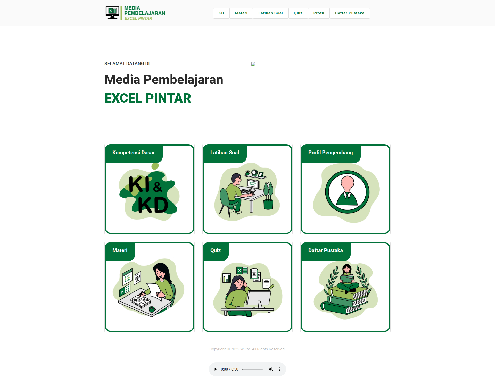
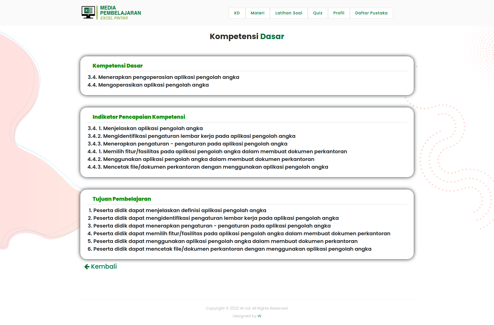
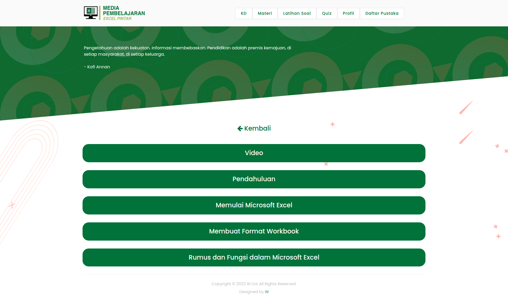
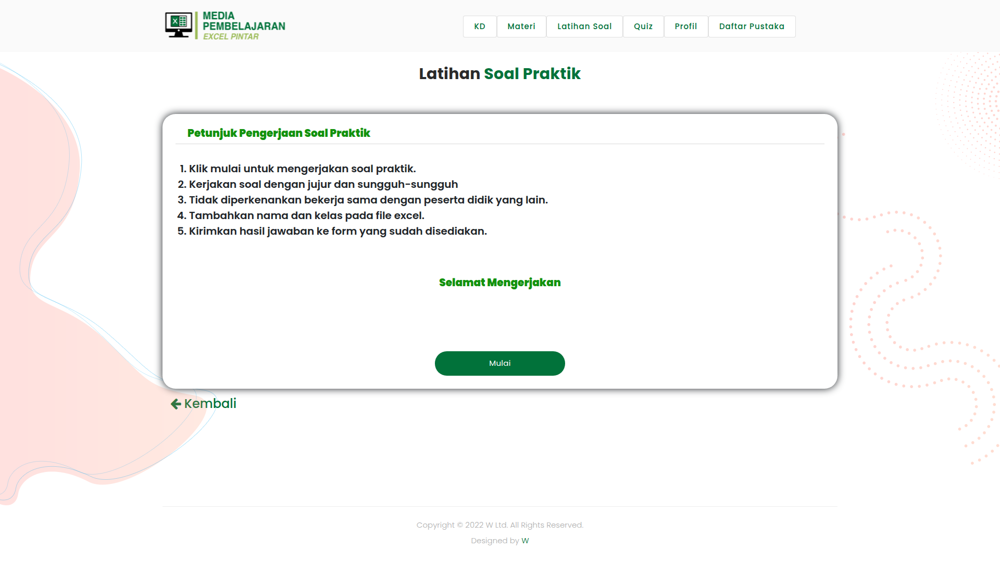
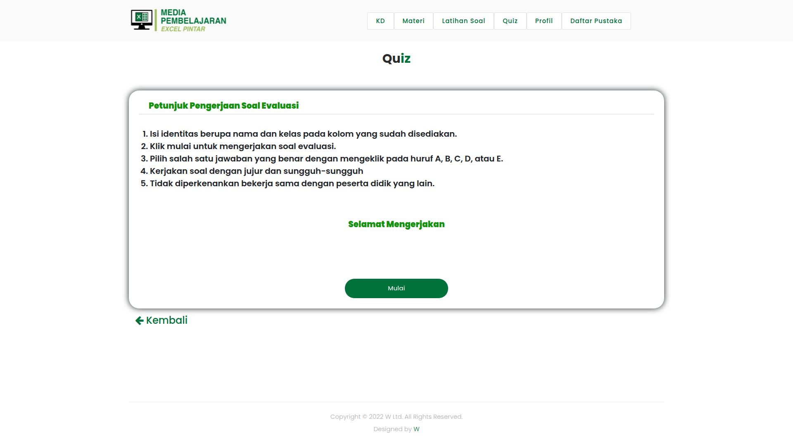

# ExcelPintar - Media Pembelajaran Interaktif

## 📚 Deskripsi Proyek

**ExcelPintar** adalah aplikasi media pembelajaran berbasis web yang dirancang khusus untuk membantu siswa memahami dasar-dasar pengoperasian Microsoft Excel secara interaktif dan menyenangkan. Aplikasi ini mengintegrasikan materi pembelajaran, video tutorial, latihan soal, dan kuis evaluasi dalam satu platform terpadu.

Dikembangkan untuk memenuhi kebutuhan pembelajaran digital di era modern, ExcelPintar menyediakan pengalaman belajar yang komprehensif dengan antarmuka yang user-friendly dan navigasi yang intuitif.

---

## 🎯 Fitur Utama

### 1. **Halaman Pendahuluan** 
Halaman sambutan yang menjelaskan tujuan dan manfaat mempelajari Microsoft Excel.


### 2. **Kompetensi Dasar (KD)**
Menampilkan:
- **Standar Kompetensi**: KD 3.4 & 4.4
- **Indikator Pencapaian Kompetensi** (IPK)
- **Tujuan Pembelajaran** yang ingin dicapai
- **Deskripsi materi** secara singkat



### 3. **Modul Materi Pembelajaran**
Pembelajaran terstruktur mencakup:
- 📖 **Pengenalan Excel** - Sejarah dan penggunaan Excel
- 🚀 **Memulai Excel** - Cara membuka dan navigasi dasar
- 📋 **Format Workbook** - Pemformatan cells dan worksheet
- 📐 **Rumus dan Fungsi** - Penggunaan formula dan fungsi Excel
- 🎨 **Format Lanjutan** - Tips pemformatan profesional



### 4. **Video Tutorial**
Konten video pembelajaran yang mendukung setiap topik materi untuk pemahaman yang lebih mendalam.


### 5. **Latihan Soal (Practice)**
Bagian praktek yang terdiri dari:
- Soal-soal interaktif berbasis topik
- Feedback langsung untuk setiap jawaban
- Latihan bertingkat dari mudah hingga sulit



### 6. **Kuis Evaluasi (Assessment)**
Tes evaluasi untuk mengukur pemahaman siswa:
- Soal pilihan ganda dan essay
- Sistem scoring otomatis
- Hasil evaluasi yang dapat diunduh



### 7. **Profil Pengembang**
Informasi lengkap mengenai:
- Tim pengembang aplikasi
- Pembimbing akademik
- Ahli media pembelajaran
- Tahun pengembangan


### 8. **Daftar Pustaka**
Referensi dan sumber belajar yang digunakan dalam penyusunan materi pembelajaran.


---

## 🛠️ Teknologi yang Digunakan

- **Frontend Framework**: HTML5, CSS3, JavaScript (Vanilla)
- **CSS Framework**: Bootstrap 4.5
- **Libraries**:
  - jQuery - Manipulasi DOM
  - Owl Carousel - Slider dan carousel
  - Isotope - Filter dan sorting konten
  - Animate.css - Animasi elemen
  - Font Awesome - Icon set
  - Google Fonts (Poppins) - Typography

- **Backend**: PHP (untuk form dan admin panel)
- **Database**: MySQL (untuk form submission)
- **Build Tool**: Prepros (CSS preprocessing)

---

## 📂 Struktur Direktori

```
javascript-excel-pintar-media-pembelajaran/
├── index.html                          # Halaman utama
├── kd.html                            # Kompetensi Dasar
├── pendahuluan.html                   # Halaman Pendahuluan
├── materi.html                        # Modul Materi
├── video.html                         # Video Pembelajaran
├── latsoal.html                       # Latihan Soal
├── quiz.html                          # Kuis Evaluasi
├── profilpengembang.html              # Profil Pengembang
├── daftarpustaka.html                 # Daftar Pustaka
├── rumus.html                         # Referensi Rumus
├── format.html                        # Guide Format
│
├── assets/                            # Aset statis
│   ├── css/
│   │   ├── templatemo-onix-digital.css
│   │   ├── animated.css
│   │   ├── fontawesome.css
│   │   └── owl.css
│   ├── js/
│   │   ├── custom.js                 # Script custom
│   │   ├── animation.js               # Script animasi
│   │   ├── owl-carousel.js
│   │   ├── isotope.js
│   │   ├── tabs.js
│   │   └── imagesloaded.js
│   ├── fonts/                         # Font files
│   └── images/                        # Gambar dan aset visual
│
├── form/                              # Backend form handling
│   ├── index.php
│   ├── process.php
│   ├── error.php
│   ├── global/                        # Config dan library
│   ├── admin/                         # Admin panel
│   └── vendor/                        # PHP dependencies
│
├── screenshots/                       # Screenshot dokumentasi
│   ├── landing_page.png
│   ├── kompetensi_dasar.png
│   ├── materi_main.png
│   ├── materi_video.png
│   ├── latihan_soal.png
│   ├── quiz.png
│   ├── profil_pengembang.png
│   └── daftar_pustaka.png
│
├── vendor/                            # Dependencies (Bootstrap, jQuery, dll)
│   ├── bootstrap/
│   └── jquery/
│
├── daftarpustaka/                     # Konten daftar pustaka
├── profil/                            # Data profil pengembang
├── m/                                 # Media dan konten
├── rev1/                              # Revisi sebelumnya
└── README.md                          # Dokumentasi proyek
```

---

## 🚀 Cara Menggunakan

### Requirement
- Browser modern (Chrome, Firefox, Edge, Safari) terbaru
- Koneksi internet untuk konten video (jika ada)
- RAM minimal 512MB

### Instalasi & Menjalankan

#### 1. **Offline (Rekomendasi)**
```bash
# Clone repository
git clone https://github.com/[username]/javascript-excel-pintar-media-pembelajaran.git

# Masuk ke direktori
cd javascript-excel-pintar-media-pembelajaran

# Buka file index.html dengan browser
# - Double-click file index.html
# atau
# - Klik kanan > Open With > Browser

# atau gunakan Live Server (jika menggunakan VS Code)
# Klik kanan index.html > Open with Live Server
```

#### 2. **Online (Dengan Server)**
Jika ingin menggunakan backend form:
```bash
# Pastikan PHP dan MySQL terinstall
# Setup database sesuai konfigurasi di form/global/config.php

# Jalankan server lokal
php -S localhost:8000

# Akses di browser: http://localhost:8000
```

---

## 👥 Tim Pengembang

| Posisi | Nama |
|--------|------|
| **Siswa Pengembang** | Donny Bimo Hendro Utomo |
| **Pembimbing Akademik** | Drs. Purwanto, MM., M.Pd. |
| **Ahli Media Pembelajaran** | Arwan Nur Ramadhan, M.Pd. |

---

## 📖 Kompetensi yang Dicakup

Aplikasi ini dirancang untuk mencapai kompetensi dasar:
- **KD 3.4**: Memahami fitur dan fungsi aplikasi pengolah data
- **KD 4.4**: Menggunakan fitur dan fungsi aplikasi pengolah data untuk mengolah data

---

## ✨ Fitur Highlight

✅ **Interface Responsif** - Dapat diakses di desktop, tablet, dan mobile  
✅ **Animasi Menarik** - Smooth animation untuk pengalaman visual yang baik  
✅ **Navigasi Intuitif** - Menu dan struktur yang mudah dipahami  
✅ **Konten Interaktif** - Quiz dan latihan soal dengan feedback langsung  
✅ **Video Embedded** - Tutorial video terintegrasi di dalam platform  
✅ **Offline Ready** - Dapat dijalankan tanpa koneksi internet (kecuali video streaming)  
✅ **SEO Friendly** - Struktur HTML yang semantik  

---

## 📝 Catatan Pengembangan

- Aplikasi ini awalnya dikembangkan untuk keperluan pembelajaran di sekolah
- Berbasis web statis yang dapat dengan mudah di-deploy di berbagai hosting
- Admin panel tersedia di `form/admin/` untuk management konten (jika diperlukan)
- Form submission data disimpan di database MySQL

---

## 📜 Lisensi

Proyek ini dikembangkan untuk keperluan pendidikan. Penggunaan dan distribusi harus mendapat persetujuan dari tim pengembang.

---

## 📧 Kontak & Support

Untuk pertanyaan atau masukan mengenai aplikasi ini, silakan hubungi tim pengembang.

---

**Dikembangkan dengan ❤️ untuk pendidikan Excel yang lebih baik**

